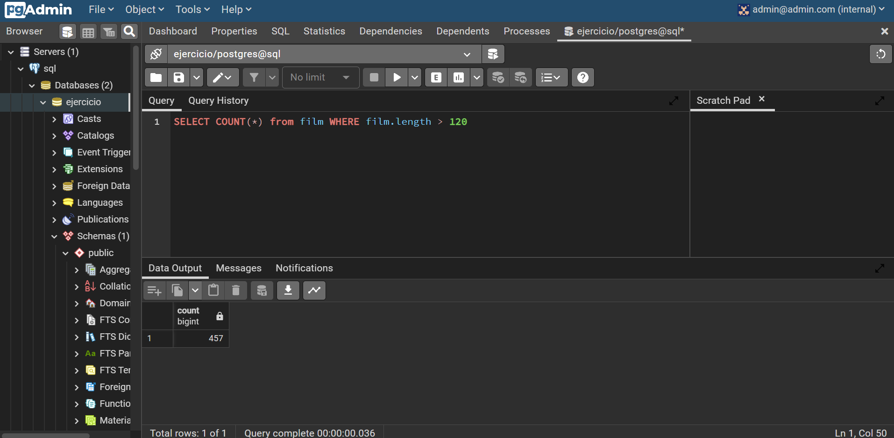
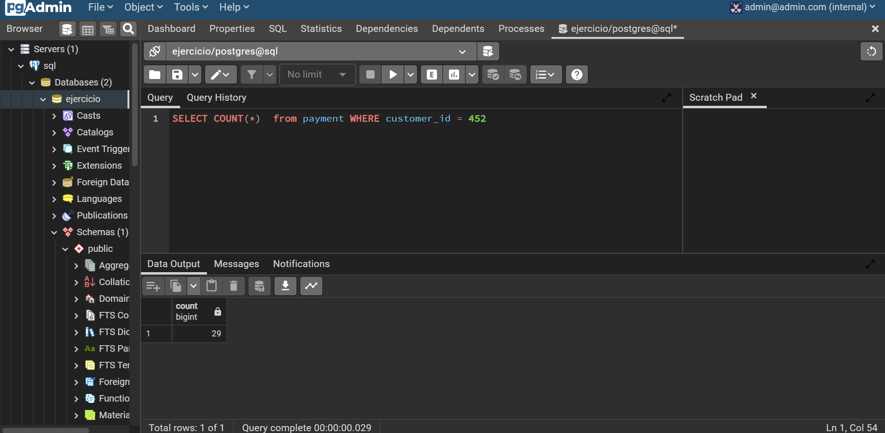
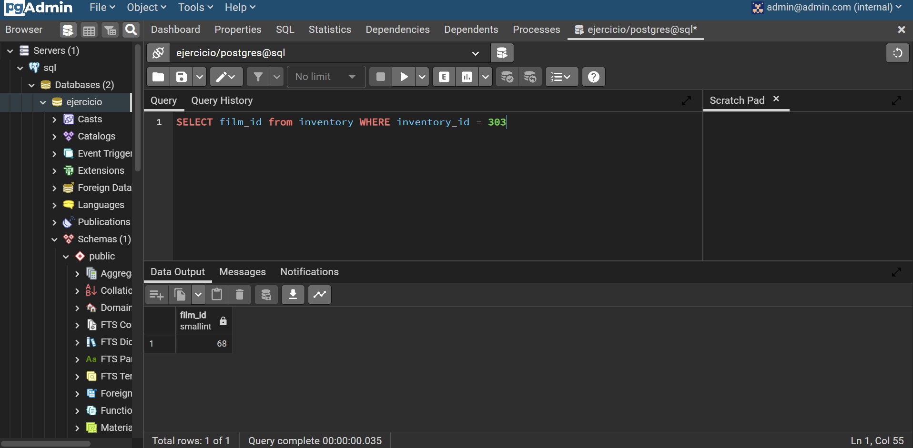
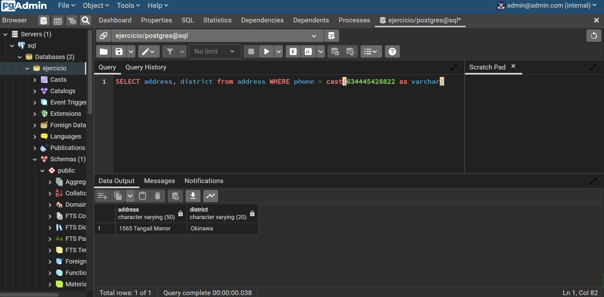

## 1. ¿Cuántas tiendas (store) hay en total?

---

## 2. ¿Cuántas películas (film) tienen una duración de más de 120 minutos?

---

## 3. ¿Cuántos pagos realizó el cliente (customer) con el ID 472?

---

## 4. ¿Cuál es el ID de la película (film) que tiene un ID de inventario (inventory) 303?

---

## 5. ¿Cuál es la dirección (address) y distrito (district) de la persona cuyo teléfono es 634445428822?

